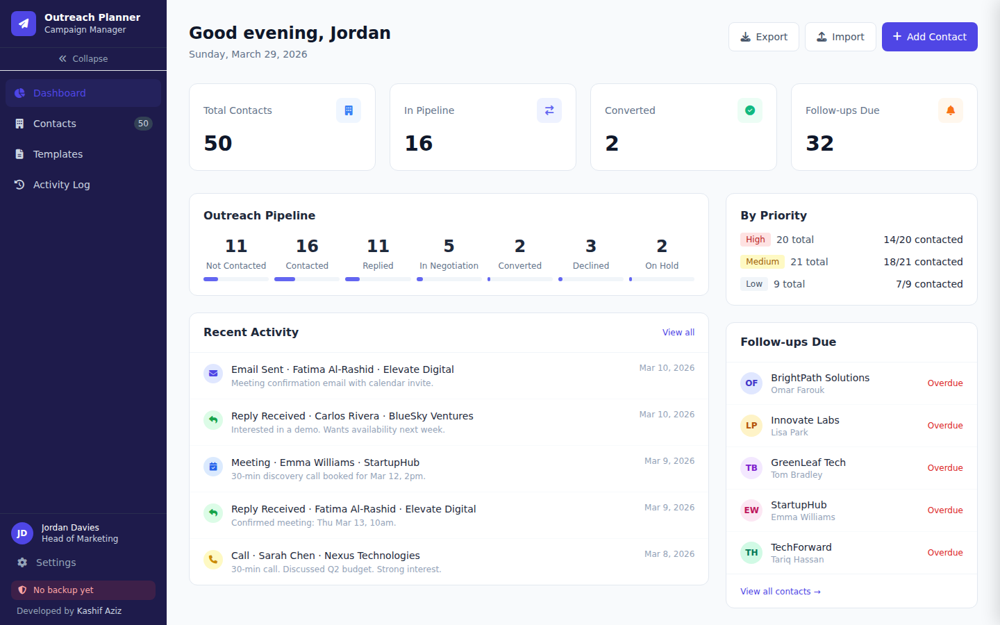
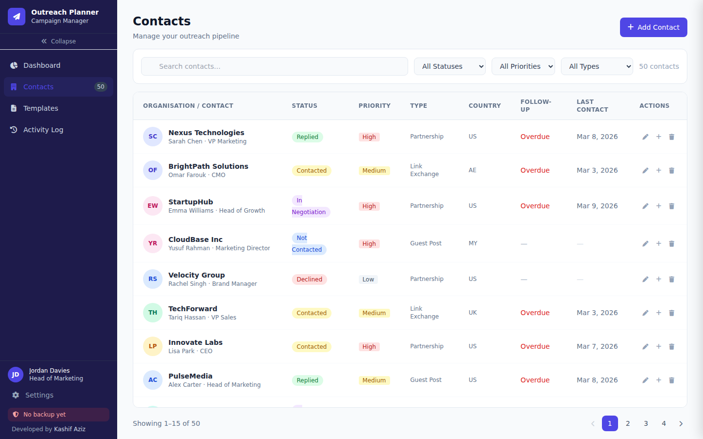
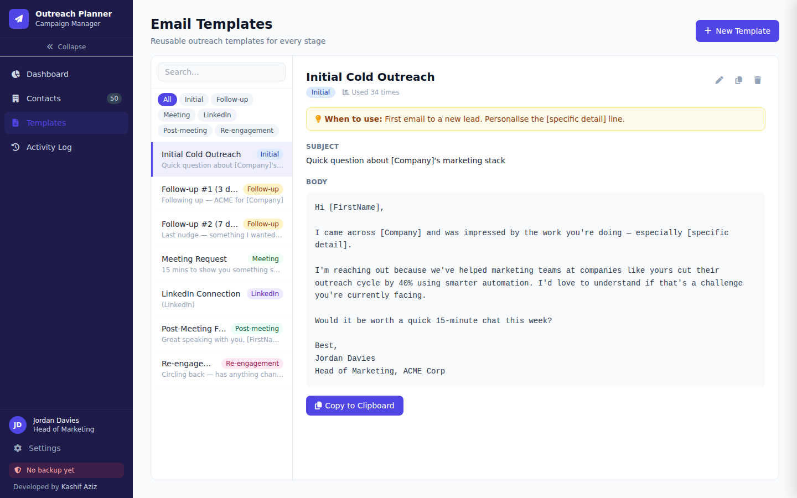
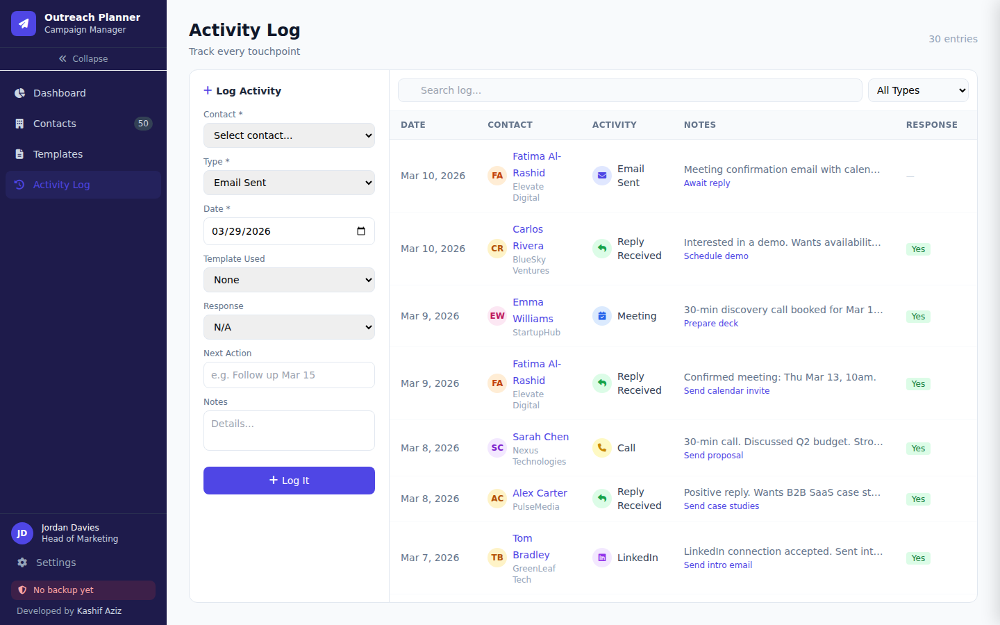
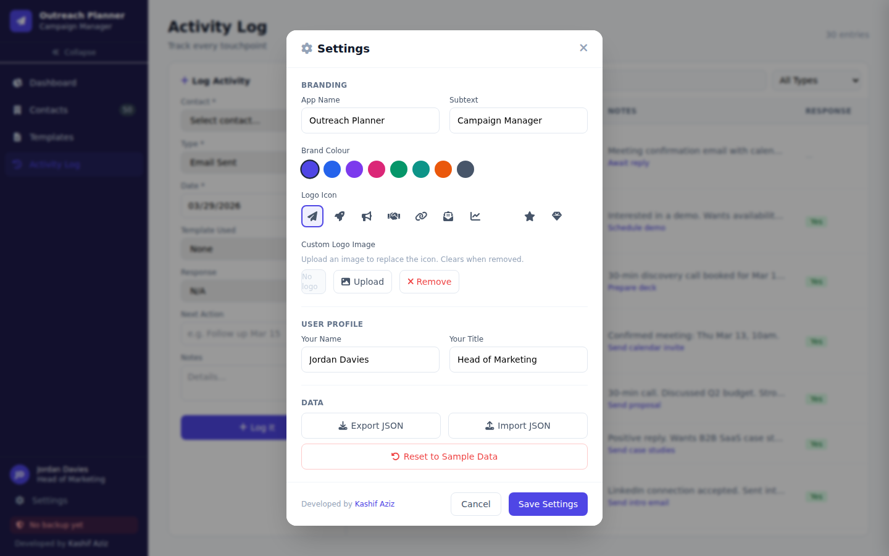
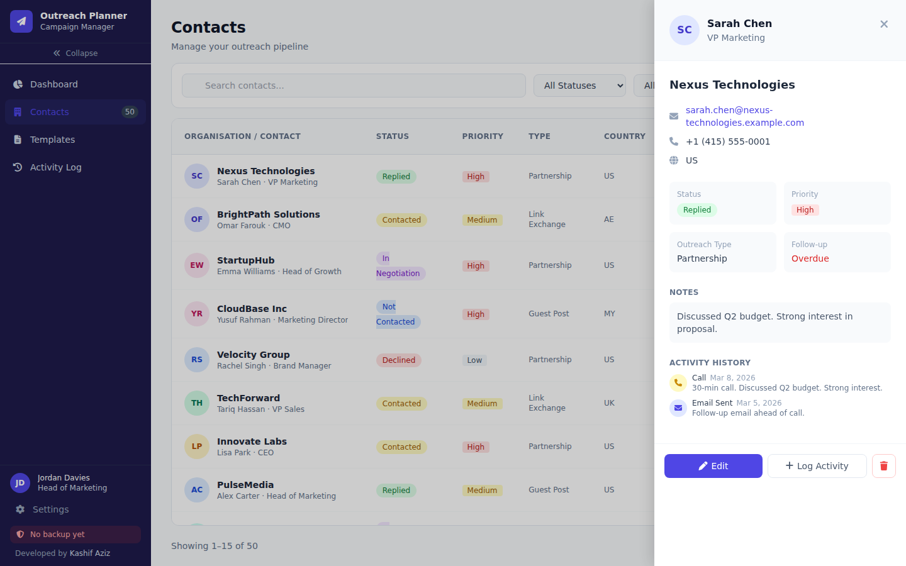

# Outreach Planner

A full-featured outreach CRM in a single HTML file. No backend, no subscriptions, no vendor lock-in.



## Why This Exists

Most outreach tools are SaaS products that cost $30–100/month, lock your data behind APIs, and require onboarding your whole team. For solo founders, freelancers, and small marketing teams running link building, partnerships, or guest post campaigns — that's overkill.

Outreach Planner is the opposite:

- **One file.** Download it, double-click it, start working. No npm, no Docker, no accounts.
- **Works offline.** No internet needed. Open from your desktop, a USB drive, or any folder. Everything — CSS, fonts, icons — is embedded inline.
- **Your data stays yours.** Data lives in your browser's localStorage. Export it as JSON anytime. No cloud, no tracking, no third-party access.
- **LLM-friendly.** Export your contacts and activity log as a single JSON file, paste it into ChatGPT/Claude, and ask it to draft follow-ups, prioritise your pipeline, or analyse response rates. The data format is clean and flat — no nested IDs or foreign keys to decode.
- **White-label ready.** Change the name, colours, logo, and user profile in Settings. Use it for different clients or projects without touching code.
- **Fork and customise.** It's vanilla HTML + JS. No framework, no build step. Read it, change it, ship it.

## Who It's For

- Solo founders doing their own outreach
- Freelancers managing link building campaigns
- Small marketing teams that don't need a full CRM
- Anyone who wants a portable, offline outreach tracker they actually own

## Features

### Dashboard
- At-a-glance stats: Total Contacts, In Pipeline, Converted, Follow-ups Due
- Outreach Pipeline with per-status breakdown and progress bars
- Priority breakdown with contacted ratios
- Recent activity feed and upcoming follow-ups

### Contacts
- Sortable columns: Organisation, Status, Priority, Type, Country, Follow-up, Last Contact
- Pagination (15 per page)
- Search + filter by status, priority, outreach type
- Contact detail drawer with full info and activity history

### Email Templates
- Two-panel layout: sidebar list + full preview
- "When to use" guidance notes per template
- Placeholder support: `[FirstName]`, `[Company]`, `[Title]`
- One-click copy to clipboard

### Activity Log
- Inline add-entry form + sortable log table
- Clickable contact names (navigates to contact drawer)
- Track type, date, template used, response, next action

### Settings & Branding
- 8 brand colour palettes (sidebar auto-adapts)
- 10 icon options or custom logo image upload
- App name, tagline, user profile — all customisable

### Data Safety
- Auto-saves to localStorage on every change
- Export / Import JSON (shareable, portable, LLM-ready)
- Auto-backup download before any destructive action
- Change counter with reminder after 10 unsaved changes
- Browser exit warning when you have unsaved work
- Backup status indicator always visible in sidebar

## Screenshots

| Dashboard | Contacts |
|-----------|----------|
|  |  |

| Templates | Activity Log |
|-----------|--------------|
|  |  |

| Settings | Contact Detail |
|----------|----------------|
|  |  |

## Getting Started

No installation needed.

```bash
git clone https://github.com/kashaziz/outreach-planner.git
cd outreach-planner
```

Then open `outreach-planner.html` in your browser:

```bash
open outreach-planner.html       # macOS
start outreach-planner.html      # Windows
xdg-open outreach-planner.html   # Linux
```

Or just double-click the file. Works from `file://` — no server required.

## Using with LLMs

Export your data as JSON (Dashboard > Export or Settings > Export JSON), then paste it into any LLM:

- *"Here's my outreach data. Which contacts should I follow up with this week?"*
- *"Draft a follow-up email for the contacts marked 'Contacted' who haven't replied in 7 days."*
- *"Analyse my response rates by outreach type and suggest what's working."*
- *"Prioritise my pipeline — who should I focus on first?"*

The JSON format is flat and readable — contacts, templates, and activity log in one file. No preprocessing needed.

## Customisation

Open **Settings** to rebrand the entire app:

- Change the app name and tagline
- Pick from 8 brand colour palettes (sidebar adapts automatically)
- Choose a logo icon or upload your own image
- Set your name and title

All settings persist in localStorage. Use different brands for different projects.

## Tech Stack

- Single HTML file (~490 KB, fully self-contained)
- Tailwind CSS (inlined, only used classes — no CDN)
- Font Awesome 6 (44 icons + 2 webfonts inlined as base64 — no CDN)
- Vanilla JavaScript, no framework, no build step
- localStorage for persistence
- Zero external dependencies

## Project Structure

```
outreach-planner/
  outreach-planner.html   # The app (single file, fully self-contained)
  data/
    defaults.json          # Reference copy of sample data (not loaded at runtime)
  screenshots/             # App screenshots
  planning/                # Feature ideas and roadmap notes
```

## Contributing

Contributions are welcome! Here's how:

1. **Fork** the repository
2. **Clone** your fork locally
   ```bash
   git clone https://github.com/<your-username>/outreach-planner.git
   cd outreach-planner
   ```
3. **Create a branch** for your feature or fix
   ```bash
   git checkout -b feature/your-feature-name
   ```
4. **Make your changes** — everything lives in `outreach-planner.html`
5. **Test locally** — open the file in your browser via `file://` and verify it works offline
6. **Commit** with a clear message explaining what and why
   ```bash
   git add outreach-planner.html
   git commit -m "Add: brief description of your change"
   ```
7. **Push** to your fork
   ```bash
   git push origin feature/your-feature-name
   ```
8. **Open a Pull Request** against `main` with a short summary of what you changed and why

### Guidelines

- Keep it as a **single HTML file** — no external dependencies, no build step
- Test with `file://` protocol (no local server) to ensure offline compatibility
- Don't add CDN links — all CSS/fonts/icons must be inlined
- Match the existing code style (vanilla JS, Tailwind utility classes)
- If adding a new feature, include a brief description in your PR

### Ideas for Contribution

Check [planning/improvements.md](planning/improvements.md) for feature ideas, or open an issue to discuss before starting large changes.

## License

MIT

---

Developed by [Kashif Aziz](https://kashifaziz.me)
